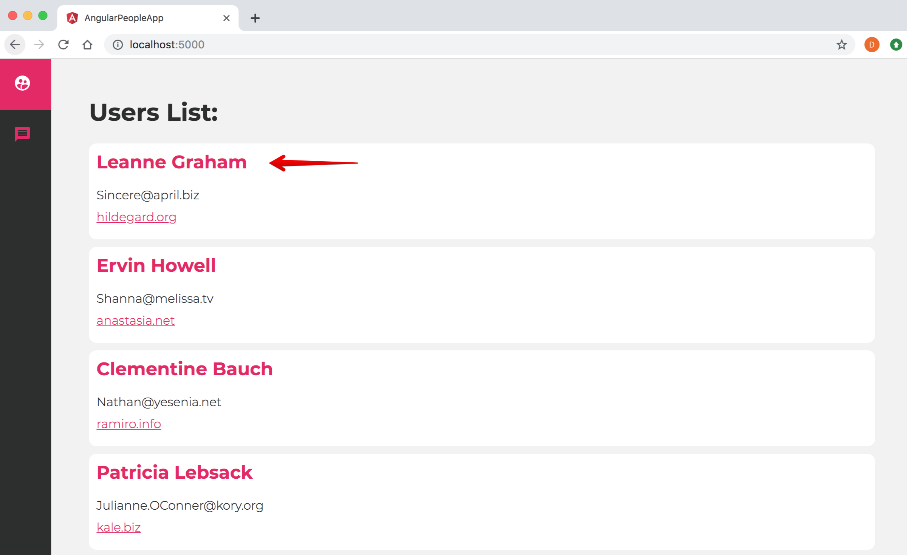
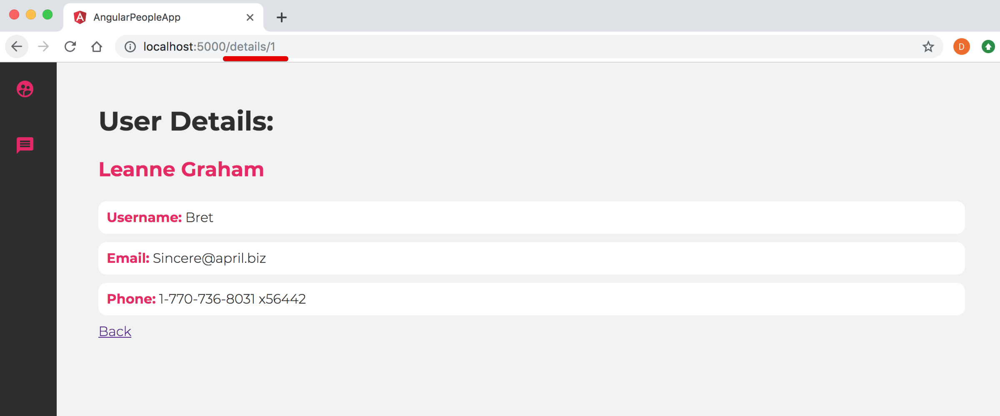
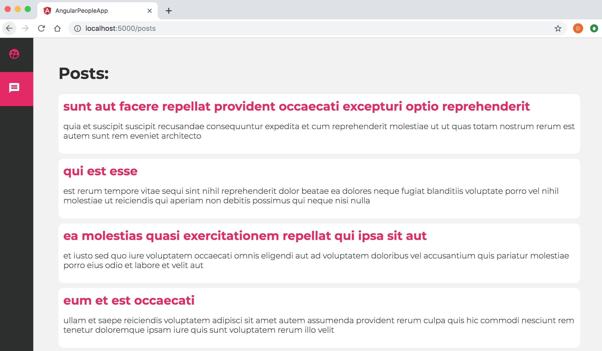
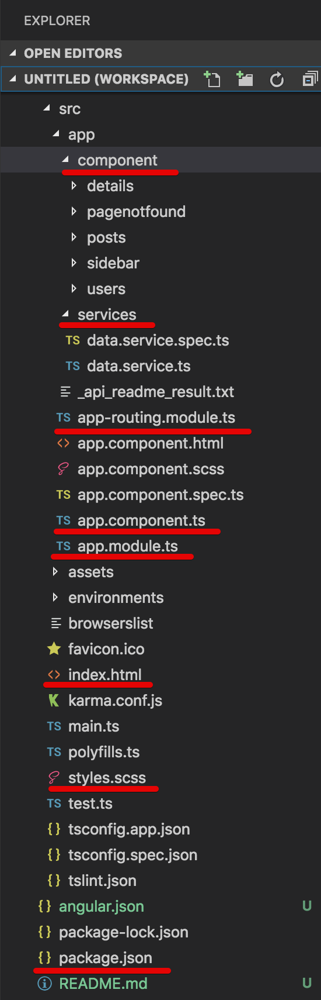
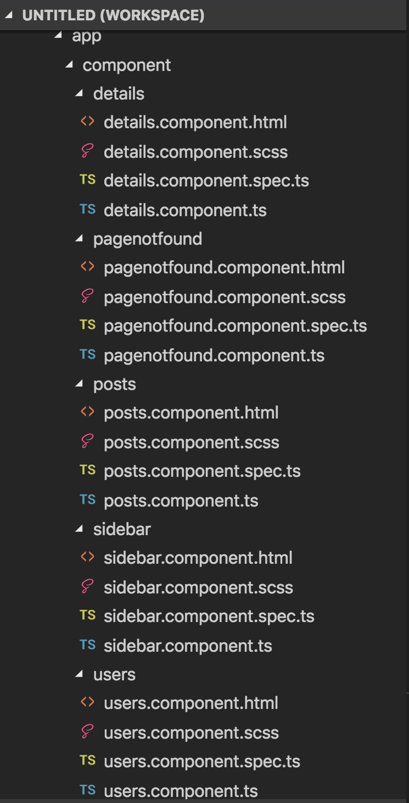

<p align="center">
    
</p>

Creating and working with Angular application - Routing, Services, HTTP (mock data)
=====================
Let's create/build below Angular Single Page Application (SPA) which uses/includes/explore many core building blocks Angular features like: multiple Components, Services, Routing and Navigation, HTTP Services, CSS Animations, etc. This Angular app will fetch data from a free 3rd party mock API service and display it Angular Material UI.

<p>
  <figure>
    &nbsp;&nbsp;&nbsp; 
    <figcaption>&nbsp;&nbsp;&nbsp; Image - Output - Angular Single Page Application (SPA) with Routing Navigation - Home View (User List)</figcaption>
  </figure>
</p>


<p>
  <figure>
    &nbsp;&nbsp;&nbsp; 
    <figcaption>&nbsp;&nbsp;&nbsp; Image - Output - Angular Single Page Application (SPA) with Routing Navigation - (User Details)</figcaption>
  </figure>
</p>


<p>
  <figure>
    &nbsp;&nbsp;&nbsp; 
    <figcaption>&nbsp;&nbsp;&nbsp; Image - Output - Angular Single Page Application (SPA) with Routing Navigation - Posts</figcaption>
  </figure>
</p>

Working with existing/cloned/copied Angular App
---------------------
- Clone or Download the project/app from Github or any other sources
- If using Visual Studio Code / Insiders, open Command panel/terminal from menu: View -> Terminal (shortcut key is `CTRL + BackTick` OR `COMMAND + J`)
- Go inside the project/app directory, command: `cd _examples-angular-peopleapp OR cd appName`
- Run command: `npm install` to install project/app dependencies `(node_modules)`
- To Build and run Angular App, command: `ng serve / npm start` OR `ng serve -o` OR `ng serve --open`
- To change the port from 4200 to other port - type command:  `ng serve --port 5000`
- To check the application in browser type path/URL: `localhost:4200 / 5000`


01 Getting Started
=====================
1.1. Pre-requisites:
---------------------
Basic familiarity with HTML, CSS and JavaScript, Angular 2/4/5/6 is must.

- HTML          - Markup
- CSS           - Style, Formates
- JavaScript    - Behaviour, Click, Validations
- TypeScript basics - Advanced JS features (Class, Arrow Function, Spread Operator)
- Text Editor / Visual Text Editors

1.2. Setup the Angular development environment:    
---------------------
In this section, we will learn how to set up a local development environment to start developing Angular apps. 

- `Node`, (website: https://nodejs.org/en) 
- `NPM`, (Node Package Manager - comes inbuilt with Node)
- `Angular CLI = Command Line Interface`, Angular CLI (Command Line Interface) for angular (website:  https://cli.angular.io/), 
    - The quickest and easiest way of starting an Angular app is through the `Angular CLI (Command Line Interface)`. It allows/helps the developer to build/generate building blocks of angular application like component, services, routings, modules, etc. with best practices quicker and easier)
- `Text Editor`
    - Visual Studio Code / Visual Studio Code Insiders (website: https://code.visualstudio.com)
    - Sublime Text, 
    - Atom, 
    - Brackets etc.

1.3. Steps to Setup the Angular development environment:
---------------------
1. Download and Install node (node comes with npm) (website: https://nodejs.org/en)
2. After installation check version of node and npm by command: `node -v` / `node --version` OR `npm -v` / `npm --version`
3. Install Angular CLI (website https://cli.angular.io/) by using the command: `npm install -g @angular/cli` (it will install Angular CLI globally)
4. After installation check version of angular CLI by using the command: `ng -v` OR `ng --version`, you can also verify angular CLI installation by command: `ng` OR `ng --help`
5. Create a new app with angular CLI by using syntax command: `ng new project/appName` example: command: `ng new angular-peopleApp` 
    - **command: `ng new angular-peopleApp --style=scss --routing` will create Angular app with `.scss` (no css) and `routing module app-routing.module.ts` files**
6. Go inside the project/app directory, command: `cd angular-peoplesApp`
7. Build and run Angular App, command: `ng serve` OR `ng serve -o` OR `ng serve --open`
    - To change the port from 4200 to other port - type command:  `ng serve --port 5000 --open`
8. Go to the browser and launch/check Angular App by entering the web address: `localhost:4200 / 5000`

1.4. Angular project/application structure-architecture summary:
---------------------
- `Angular app`: (Show graphical representation of `src -> app -> components` folder)
    - Angular apps are modular in nature 
    - Consists of one or more modules (Angular App is a collection of one or many modules)
    - Modules are main feature area - User module, Admin module, Dashboard module, Employee module)
    - `Angular Application Root Module is AppModule (app.module.ts) ` 
    - `Modules` are lines of code which can be IMPORTed or EXPORTed
        - Module consists of one or more Components and Services 
        - `Components` - .HTML Template + .ts Class + .CSS 
            - A component represents/controls view in the browser
            - (example: header, footer, sidebar, common panels, common search utility, similar feature components used throughout the application)
            - `Angular Application Root (bootstrapped) component is AppComponent (app.comoponent.ts)`
        - `Services` - Class which consists of Business logic (common programming feature used throughout the application)

<p>
  <figure>
    &nbsp;&nbsp;&nbsp; 
    <figcaption>&nbsp;&nbsp;&nbsp; Image - Angular Application Folder structure-Architecture</figcaption>
  </figure>
</p>

Modules interact and ultimately render Components+Services view in the browser.

1.5. Angular project/application File / Folder structure-Architecture summary:
---------------------
- `package.json`: consists of Node/NPM library/package/module dependencies for application development
- `node_modues` - folder consists of all installed packages
- `src/main.ts` - entry point to angular application. src/index.html
- `app/app.module.ts` - route module of application
- `app/app.component.ts` - route component of application
- `app-routing.module.ts` - consits of RoutingModule/Routes for application - required path and components details
- **`ng serve / npm start` -> Initialization proeces: main.ts (index.html) -> app.module.ts -> app.component.ts -> (app.component.html + css)**

1.6. Angular Module (app.module.ts)
---------------------

> **Syntax & Example**: app.module.ts
```ts
// modules
import { BrowserModule } from '@angular/platform-browser';
import { NgModule } from '@angular/core';
import { BrowserAnimationsModule } from '@angular/platform-browser/animations';
import { AppRoutingModule } from './app-routing.module';

// components
import { AppComponent } from './app.component';
import { SidebarComponent } from './component/sidebar/sidebar.component';
import { PostsComponent } from './component/posts/posts.component';
import { UsersComponent } from './component/users/users.component';
import { DetailsComponent } from './component/details/details.component';

// services
import { HttpClientModule } from '@angular/common/http';
import { PagenotfoundComponent } from './component/pagenotfound/pagenotfound.component'; 
import { DataService } from './services/data.service';

@NgModule({
  declarations: [
    // components
    AppComponent,
    SidebarComponent,
    PostsComponent,
    UsersComponent,
    DetailsComponent,
    PagenotfoundComponent
  ],
  imports: [ 
    // modules
    BrowserModule,
    AppRoutingModule,
    HttpClientModule,
    BrowserAnimationsModule
  ],
  // services must be included here
  providers: [ DataService],
  bootstrap: [AppComponent]
})
export class AppModule { }
```

As and when we use Angular CLI to generate components and services, it will automatically update app.module.ts file to import and add them to the `@NgModule decorator`. `Components are added to the declarations array`, and `services are added as providers`. You will also find yourself adding various imports to the imports array. For instance, when we want to add animations, HTTP, routes, routers we will add them here. In the absence of Angular CLI, we may need to all entries carefully and manually in app.module.ts.

1.7. Dealing with Angular Components (creating components)
---------------------
- The core/key idea behind Angular is to build application using `reusable parts/chunks i.e. components`
- Components are main building blocks of UI and an/any angular application
- `Angular Application Root (bootstrapped) component is AppComponent (app.comoponent.ts)`

<p>
  <figure>
    &nbsp;&nbsp;&nbsp; 
    <figcaption>&nbsp;&nbsp;&nbsp; Image - Angular Components</figcaption>
  </figure>
</p>

A component is self contained, reusable piece of UI made up of 3 important parts:
1. `Template` - `View, HTML code` (User Interface for application also known as view)
2. `Class` - `Business logic/Application logic` for the view, `TypeScript/JavaScript code`, (Data, Methods & properties)
3. `Decorator/Metadata` - `Metadata, a @function` which provide more information for angular class. example: app.component.ts: 

> **Syntax & Example**: app.component.ts
```typescript
@Component({
    selector: 'app-root', // selector - a custom html tag
    templateUrl: './app.component.html', // template/templateUrl - html view,
    styleUrls: ['./app.component.css'] // styleUrls - css style sheet
})
```

1.8. Creating component
---------------------
- We can create component manually, but in that scenario, we need to do and follow various steps/manual entries
- It's advisable to use angular CLI to create a component, services, routing, etc. 
- `To create a component using angular CLI`:
    - command: `ng generate component componentName` OR `ng g c componentName`
    - **`It generates 4 new files: .css-styles, .html-markup, .spec.ts-test, .ts-class`**
    - Also, an automated `import` /update/entry of components is done in `app.module.ts` file at the top `imports section` and in `declarations array` which consists of all the components used in the application
    - A component must be a member of/belongs to an `@NgModule - declarations array` in order for it to be usable by another component or application
- Let us create some required component for our current app:
    - ng generate component sidebar <br/>
    - ng g c posts <br/>
    - ng g c users <br/>
    - ng g c details <br/>

1.9. Using component in the application
---------------------
- To use any component in the application, we need to copy and paste new components `'selector'` from respective .ts file i.e. `'app-sidebar'` as a tag in `app.component.html`

> **Syntax & Example**: app.component.html
```html
<div id="container">
  <app-sidebar></app-sidebar>

  <div id="content">
    <router-outlet></router-outlet>
  </div>

</div>
```

- Here `<app-sidebar></app-sidebar>` is selector of newly created sidebar component from `sidebar.component.ts` file
- **router-outlet**
    - The directive `(<router-outlet>)` that marks where the router displays a view (a container to hold different views/components loaded as users perform application tasks/actions). `(<router-outlet>)` is used to load different pages/components when the user clicks on different links or buttons.

1.10. index.html
---------------------
- In our current application we will use `Angular Material Icon` and `Google Fonts`, so lets first import/link them under `<head>` section of index.html

> **Syntax & Example**: 
```html
<!doctype html>
<html lang="en">

<head>
  <meta charset="utf-8">
  <title>AngularPeopleApp</title>
  <base href="/">

  <meta name="viewport" content="width=device-width, initial-scale=1">
  <link rel="icon" type="image/x-icon" href="favicon.ico">

  <!-- material icon -->
  <link href="https://fonts.googleapis.com/icon?family=Material+Icons" rel="stylesheet">

  <!-- google fonts -->
  <link href="https://fonts.googleapis.com/css?family=Montserrat:300,700" rel="stylesheet">

</head>

<body>
  <app-root></app-root>
</body>

</html>
```

- Learn more about [Angular Material Icon - https://material.io/tools/icons/?style=baseline](https://material.io/tools/icons/?style=baseline) and [Google Fonts - https://fonts.google.com/](https://fonts.google.com/)
